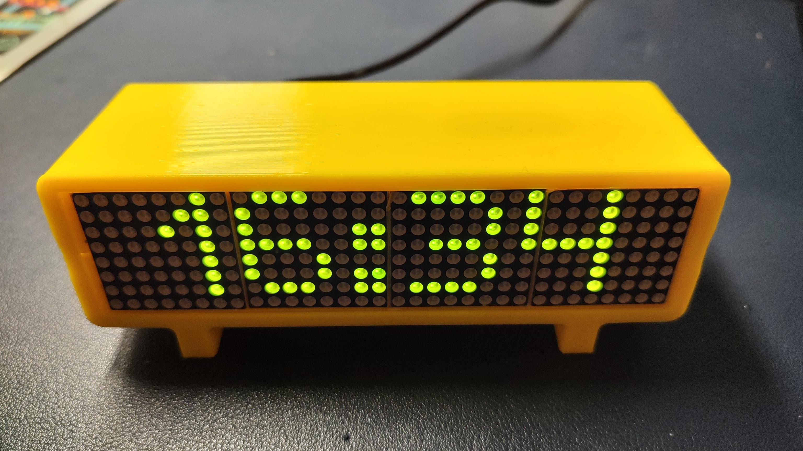
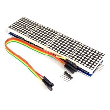
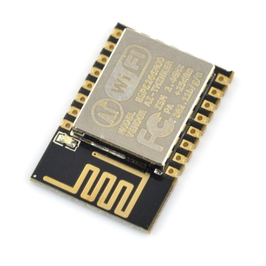

# Dotmatrix Dsiplay

Simple led matrix display using MAX72xx 4x 8x8 led array and ESP8266 module.

## Main parts

| Led array  | ESP |
|---|---|
|  |   |

enclosure from [thingiverse thing:3348666](https://www.thingiverse.com/thing:3348666)

## Develop

to edit esp code, open hardware folder in Arduino IDE

to edit web interface, go to web-interface folder and see readme. After every change remember to run build web.
